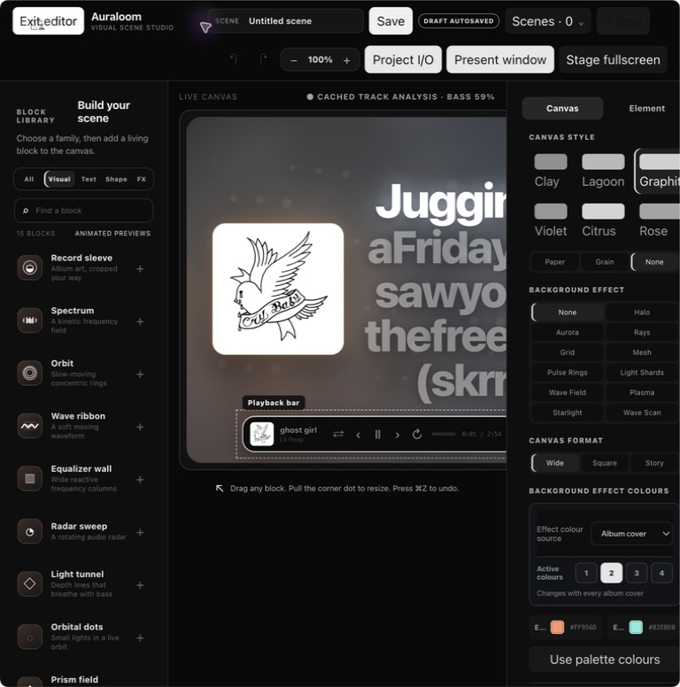
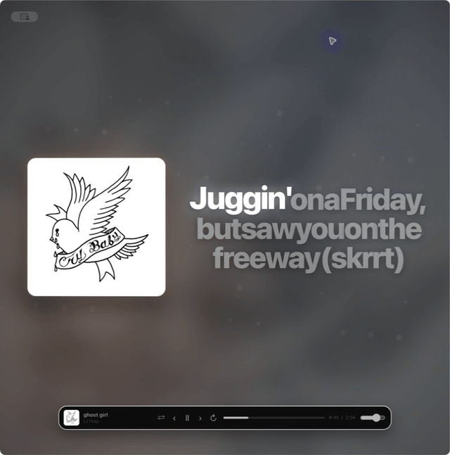

<div align="center">

# Auraloom

### Build a visual world for the music already playing in Spotify.

**A layered, audio-reactive scene studio for [Spicetify](https://spicetify.app/).**

`macOS` · `Windows` · `Linux` · `Spotify Desktop` · `Spicetify Custom App`

</div>



> Unofficial, desktop-only software. Auraloom runs inside Spicetify, which modifies the Spotify desktop client and may be affected by Spotify updates. It is not affiliated with Spotify or any music artist.

## A visualizer is a starting point. Auraloom is the studio.

Auraloom lets you compose a live scene around the current track instead of choosing a single fixed effect. Start with an entirely black canvas or an album-derived atmosphere, then add independent blocks for artwork, type, lyrics, waves, spectrum, shapes, playback and finishing effects. Every block has its own colours, transform, blend treatment, audio mapping and position in the scene stack.

The interface is deliberately calm: a block library on the left, a live canvas in the middle and progressive controls for the selected block on the right. It is designed to be useful in a minute, yet deep enough for a fully authored stage look.

## Ten-second Presentation Window capture



This capture is a silent ten-second local Spotify session. It shows the real Presentation Window canvas; the displayed track artwork and lyric excerpt remain the property of their respective rightsholders. Replace the demo media before redistributing the repository if you do not hold permission to publish it.

## Designed for scenes, not presets alone

| Build freely | Shape precisely | Perform cleanly |
| --- | --- | --- |
| Add cover art, adaptive lyrics, titles, custom copy, playback bars, spectrum, waveform, EQ wall, rings, tunnel, particles, aurora, depth grid and more. | Move, resize, rotate, align, lock, hide, duplicate and reorder every block. Set independent colour palettes, opacity, blur, masking, blend, crop, aura and music response. | Open the full editor from the Spotify rail, switch to a distraction-free Stage, or move a native Presentation Window to another monitor. |

### Core capabilities

- **True layer composition.** The Scene stack orders complete elements and full-canvas effects together. A layer's glow, blur and blend treatment cannot jump over an item that sits above it.
- **Independent colour systems.** Every background, effect and block can use manual colours, album-cover colours, cover colours that shift with music, a fixed spectrum, or a reactive RGB spectrum. Choose one to four active colours per source.
- **Reliable colour editing.** The outer ring controls hue, the central plane controls saturation and brightness, and exact HEX, HSV and RGB fields remain available for precision work.
- **Audio analysis, not a looping BPM trick.** When Spotify exposes track analysis, Auraloom maps time-aligned energy, bass, mids, highs, attacks and beat impacts to each responsive layer. Analysis is cached locally for later offline use when Spotify permits it.
- **Adaptive lyrics.** Auraloom prefers Spotify timing, then can use word-timed NetEase data, LRCLIB or Lyrics.ovh. Word highlighting is used only when timing exists; otherwise the app labels and uses a stable line-level fallback.
- **Presentation-ready output.** Stage removes the editor. Presentation Window is a normal native window with the operating system's move, resize, minimize, fullscreen and close controls.
- **Project library.** Autosaved local drafts, named scenes, duplication, a startup scene, scene cards and JSON backup/import keep complex work safe.

## Audio response, under your control

Each layer can be static or can listen to Bass, Mids, Highs, Track energy, Beat impact or Drop / attack. Set strength, sensitivity, gate, smoothing, transform, colour source and response style separately. Background art can independently zoom or lift with the track; album-cover light can stay completely off.

For long sessions, the **Track analysis → Performance** control provides three rendering profiles:

- **Eco** — 12fps signal updates and a larger visual-change threshold for lower CPU use.
- **Balanced** — 20fps signal updates; recommended for normal editing and presentation.
- **High** — up to 31fps signal updates for the fastest compatible response.

Static scenes do not fetch Spotify analysis. Auraloom also skips lyric-provider requests unless a visible Adaptive lyrics block exists, pauses its animation loop while the document is hidden and avoids attaching keyboard listeners on every audio frame.

## Installation

### One command from this repository

Prerequisites: Spotify Desktop, [Spicetify](https://spicetify.app/), and Node.js 18 or newer.

```sh
git clone https://github.com/YOUR-ACCOUNT/auraloom-spicetify.git
cd auraloom-spicetify
npm run install:local
```

The installer copies Auraloom to the correct CustomApps directory for the current operating system, enables `hudbacastum` in Spicetify and runs `spicetify apply`. Restart Spotify, then select **Auraloom** from the top-left Custom Apps rail.

### Manual install

1. Download this repository as a ZIP and unpack it.
2. Copy `index.js`, `style.css` and `manifest.json` into a folder called `hudbacastum` in your Spicetify `CustomApps` directory.
3. Enable and apply it:

```sh
spicetify config custom_apps hudbacastum
spicetify apply
```

| Platform | Default CustomApps location |
| --- | --- |
| macOS | `~/.config/spicetify/CustomApps/` |
| Linux | `~/.config/spicetify/CustomApps/` (or the path selected by `SPICETIFY_CONFIG` / `XDG_CONFIG_HOME`) |
| Windows | `%APPDATA%\spicetify\CustomApps\` |

The folder name must remain `hudbacastum`: it is the internal Custom App route that Spotify/Spicetify registers. The visible product name is **Auraloom**.

### Marketplace

Once this public repository has the `spicetify-apps` GitHub topic, the included Marketplace manifest enables discovery in Spicetify Marketplace. Marketplace Custom Apps still need the normal `spicetify apply` step after installation. See [the publication checklist](docs/MARKETPLACE.md) for the exact repository requirements.

## First scene in sixty seconds

1. Click **Auraloom** in Spotify's Custom Apps rail. The complete editor opens immediately.
2. Pick **Pure black**, **Solid**, **Gradient**, **Album art** or **Upload** in **Canvas → Background studio**.
3. Choose a family in **Block library**, then press `+` on an element to add it.
4. Drag a block on the canvas; use the corner handle to resize it. Hold `Option` / `Alt` for free placement when magnetic alignment is on.
5. Select a block, then use **Element → Colour lab** and **Audio response** to personalise it.
6. Use **Scene stack** to place complete blocks and background effects above or below each other.
7. Click **Save** to store the scene locally. Use **Stage fullscreen** for output or **Present window** for a second display.

## Useful shortcuts

| Shortcut | Action |
| --- | --- |
| `⌘/Ctrl + Z` | Undo |
| `⌘/Ctrl + Shift + F` | Toggle full editor |
| `⌘/Ctrl + Shift + P` | Open or focus Presentation Window |
| `Esc` | Exit Stage, fullscreen editor or open modal |
| `Delete` / `Backspace` | Delete the selected layer |

## Privacy and limitations

- Projects, presets, cached analysis and imported backup data remain in Spotify's local browser storage. Auraloom does not upload scene settings or personal images.
- Spotify does not expose protected raw audio. Auraloom only reacts to the data Spotify makes available; an uncached offline track remains stable rather than pretending it has live analysis.
- Lyrics come from the services selected by the app. Availability and word timings differ by track, region and provider.
- Spotify updates can temporarily affect Spicetify Custom Apps. Re-run `spicetify apply` after updating Spotify when necessary.

## Development

There are no runtime dependencies. The source is a ready-to-install Custom App folder.

```sh
npm run check          # JavaScript syntax + manifest checks
npm run build:release  # writes a clean dist/hudbacastum folder
npm run install:local  # copies to Spicetify and applies it locally
```

The GitHub Actions workflow runs `npm run check` on every push and pull request.

## Credits

Auraloom is an original Spicetify Custom App by Daniel Tryner. Its creative direction was informed by the idea of living Spotify backdrops such as [backmusic](https://github.com/rolandyangg/backmusic_extension), while its editor, scene model, controls, audio handling and visual system are independently implemented.

Built for [Spicetify](https://spicetify.app/). Not affiliated with or endorsed by Spotify, Lil Peep, or any lyrics or artwork provider.
